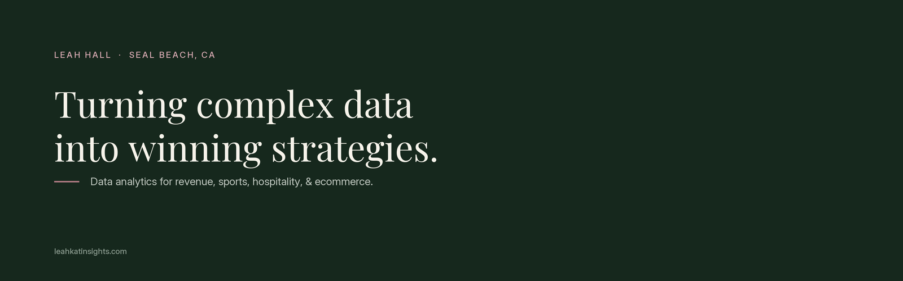

I bring the data in, build the analytics, and turn it into strategy.

Ecommerce Director by day, MBA candidate (Data Analytics concentration, Hotel & Casino Management specialization), and building a portfolio of sports and hospitality analytics on real cloud infrastructure: Databricks, Delta Lake, AWS, and SQL first.

**[leahkatinsights.com](https://leahkatinsights.com)** · [LinkedIn](https://www.linkedin.com/in/leah-hall/) · [leah@leahkatinsights.com](mailto:leah@leahkatinsights.com)

## Featured projects

| | Project | What it does | Built with |
|:--|:--|:--|:--|
| 5 | [Hotel RevPAR Performance Readout](https://github.com/leahkatinsights/hotel-revpar-readout) | STR-style monthly readout for an urban hotel: occupancy, ADR, RevPAR, and MPI / ARI / RGI against a comp set, from 119,000 real bookings, with a one-page GM memo | Databricks, Delta Lake, PySpark, pytest |
| 3 | [Lululemon DCF Valuation Pipeline](https://github.com/leahkatinsights/lululemon-dcf-pipeline) | SEC EDGAR XBRL to bronze / silver / gold, SQL window functions, a 5-year DCF with bear / base / bull scenarios, and a reverse DCF that backs out what the market is pricing in | Python, DuckDB, Parquet, scipy |
| 4 | [Multi-Channel Reorder Forecasting System](https://github.com/leahkatinsights/reorder-forecasting-system) | Recency-weighted velocity model and a five-state reorder engine that turns Shopify and Square sales history into a daily purchase-order queue | Streamlit, Postgres, Shopify and Square APIs |
| 2 | [Customer Lifetime Value Model](https://github.com/leahkatinsights/customer-lifetime-value-model) | 65k synthetic golf-retail transactions to RFM features in SQL, then BG/NBD and Gamma-Gamma models for 12-month revenue per customer, on a Delta pipeline | Databricks, Delta Lake, SQL, lifetimes |
| 1 | [Stock Market Analytics Lakehouse](https://github.com/leahkatinsights/stock-analytics-lakehouse) | Yahoo Finance to S3, an S3-triggered Lambda that summarizes new files through AWS Bedrock, Delta Lake and SQL trend analytics on Databricks | AWS S3, Lambda, Bedrock, Databricks |

Full writeups with charts and the reasoning behind each build: [leahkatinsights.com/projects](https://leahkatinsights.com/projects.html)

## How I build

- Medallion pipelines (bronze / silver / gold) on Databricks, or plain Parquet when the job is small
- SQL first: window functions, star schemas, one row per entity before any model touches it
- Reproducible by default: seeded simulations, tests, and every exhibit labeled with its source
- The deliverable is a decision, not a notebook: each project ends in a memo or an action queue

## Certifications

Certification in Hotel Industry Analytics (CHIA), CoStar Group · [AWS Machine Learning Foundations](https://www.credly.com/badges/aa0f9654-ee23-45f4-a087-c695af62ba53/public_url) · [AWS Cloud Foundations](https://www.credly.com/badges/0ca86bce-c34c-464d-bfa1-be825f8ce5e4/public_url) · Google Data Analytics · IBM Data Analyst · IBM Data Science

## Now

- MBA, Fall 2026: Financial Analytics (R) and Economics
- Next up on the portfolio: Vail Resorts Monte Carlo, Yankees cost-per-win, Augusta analytics
